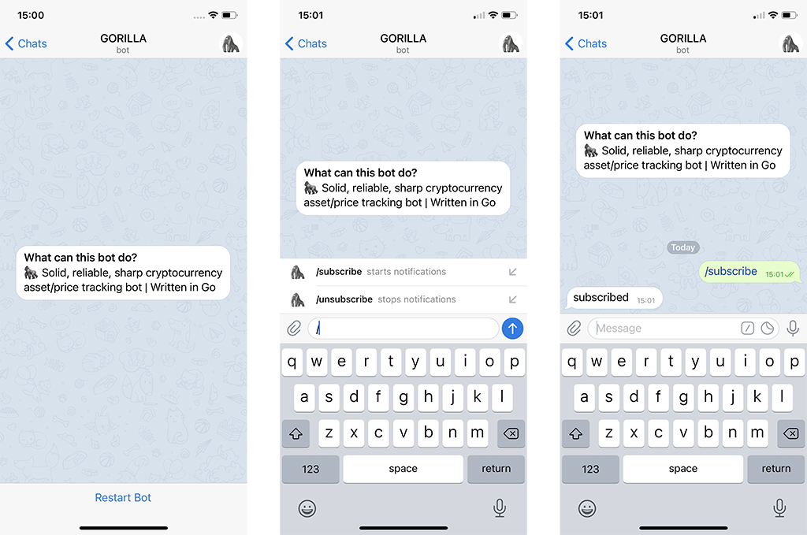
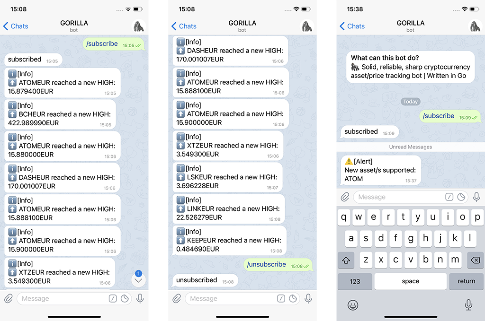

=

### 🦍 Solid, reliable, sharp cryptocurrency asset/price tracking bot | Written in Go

<br>

<p align="center">
    
</p>

# Description

**```gorilla```** automates monitoring and helps in evaluating availability and prices trending of all the [Kraken exchange](https://kraken.com)'s tradable assets, by broadcasting notifications through a [Telegram bot](https://core.telegram.org/bots).

# Prerequisites

In order to be used, **```gorilla```** needs:
* a working [Go](https://golang.org/doc/install) installation
* a **Telegram token** (please ask to the [BotFather](https://core.telegram.org/bots#3-how-do-i-create-a-bot) to get yours)

# Setup

Before start, there are a few things to be set in the **```.env```** file:

```
CURRENCY=YOUR_CURRENCY_HERE
TOKEN=YOUR_TELEGRAM_BOT_TOKEN_HERE
INTERVAL=REFRESH_INTERVAL_EXPRESSED_IN_SECONDS
DEBUG=TRUE|FALSE
```

**NOTE**: for an updated list of supported currencies, have a look [here](https://support.kraken.com/hc/en-us/articles/360000381846).


# Usage

Once you downloaded this repo and placed in the root folder, just run the following command in your **```shell```**:

```go
go run main.go
```

**NOTE**: you will see some relevant output only if you set **```DEBUG=TRUE```** in the **```.env```** file.

# Commands

Once **```gorilla```** is up and running as well as the **```Telegram bot```** on his back, it is possible to trigger these actions from any compatible client:

* ```/subscribe```: starts notifications
* ```/unsubscribe```: stops notifications

# Output





# Disclaimer

This software comes without any kind of warranties.

I will not be liable for any damages related to the use or the misuse of this software.

You are the sole responsible.
